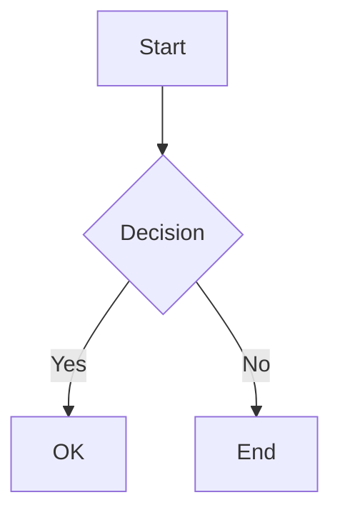
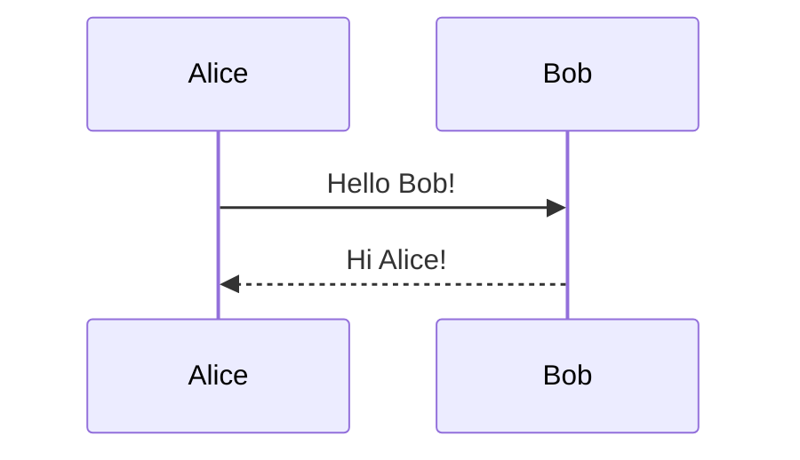

# Markdown Syntax Cheatsheet

A comprehensive reference for Markdown formatting syntax.

## Headers

### Syntax
```markdown
# H1 Header
## H2 Header
### H3 Header
#### H4 Header
##### H5 Header
###### H6 Header

Alternative H1
==============

Alternative H2
--------------
```

## Text Formatting

### Basic Formatting
```markdown
**Bold text**
__Bold text__

*Italic text*
_Italic text_

***Bold and italic***
___Bold and italic___

~~Strikethrough~~

`Inline code`

> Blockquote
> Multiple lines
> in blockquote
```

### Result
**Bold text**, *Italic text*, ***Bold and italic***, ~~Strikethrough~~, `Inline code`

## Lists

### Unordered Lists
```markdown
- Item 1
- Item 2
  - Nested item 2.1
  - Nested item 2.2
- Item 3

* Alternative syntax
* Using asterisks

+ Or plus signs
+ Also works
```

### Ordered Lists
```markdown
1. First item
2. Second item
   1. Nested item 2.1
   2. Nested item 2.2
3. Third item

1. Numbers auto-increment
1. Even if you use 1
1. For all items
```

### Task Lists
```markdown
- [x] Completed task
- [ ] Incomplete task
- [ ] Another task
```

## Links

### Link Syntax
```markdown
[Link text](https://example.com)
[Link with title](https://example.com "Title on hover")

[Reference link][ref]
[ref]: https://example.com

<https://auto-linked-url.com>
<email@example.com>
```

### Internal Links
```markdown
[Link to header](#header-name)
[Link to section](#text-formatting)
```

## Images

### Image Syntax
```markdown


![Reference image][img-ref]
[img-ref]: image.jpg

[](https://example.com)
```

### Image with Size (HTML)
```html

```

## Code

### Inline Code
```markdown
Use `backticks` for inline code
```

### Code Blocks
````markdown
```
Basic code block
No syntax highlighting
```

```javascript
// JavaScript code block
function hello() {
  console.log("Hello, World!");
}
```

```python
# Python code block
def hello():
    print("Hello, World!")
```
````

### Indented Code Block
```markdown
    Indent with 4 spaces
    for code block
    (less common)
```

## Tables

### Basic Table
```markdown
| Header 1 | Header 2 | Header 3 |
|----------|----------|----------|
| Cell 1   | Cell 2   | Cell 3   |
| Cell 4   | Cell 5   | Cell 6   |
```

### Aligned Tables
```markdown
| Left | Center | Right |
|:-----|:------:|------:|
| L1   | C1     | R1    |
| L2   | C2     | R2    |
```

### Result
| Left | Center | Right |
|:-----|:------:|------:|
| L1   | C1     | R1    |
| L2   | C2     | R2    |

## Horizontal Rules

### Syntax
```markdown
---

***

___

- - -
```

---

## Blockquotes

### Basic Blockquote
```markdown
> This is a blockquote
> It can span multiple lines
```

### Nested Blockquotes
```markdown
> Level 1
>> Level 2
>>> Level 3
```

### Blockquote with Formatting
```markdown
> **Bold in blockquote**
> 
> - List in blockquote
> - Another item
> 
> `Code in blockquote`
```

## HTML in Markdown

### Allowed HTML
```html
<div>HTML div element</div>
<span style="color: red;">Colored text</span>
<br>
<hr>
<details>
  <summary>Collapsible section</summary>
  Hidden content here
</details>
```

## Escaping Characters

### Escape Special Characters
```markdown
\* Escaped asterisk
\_ Escaped underscore
\# Escaped hash
\[ Escaped bracket
\] Escaped bracket
\( Escaped parenthesis
\) Escaped parenthesis
\\ Backslash
\` Backtick
```

### Characters to Escape
```
\ ` * _ { } [ ] ( ) # + - . ! |
```

## Footnotes

### Syntax
```markdown
Here's a sentence with a footnote[^1].

Another reference[^note].

[^1]: This is the first footnote.
[^note]: This is another footnote with a custom name.
```

## Definition Lists

### Syntax
```markdown
Term 1
: Definition 1

Term 2
: Definition 2a
: Definition 2b
```

## Abbreviations

### Syntax
```markdown
The HTML specification is maintained by the W3C.

*[HTML]: Hyper Text Markup Language
*[W3C]: World Wide Web Consortium
```

## GitHub Flavored Markdown

### Mentions
```markdown
@username
```

### Issue References
```markdown
#123
user/repo#123
```

### Emoji
```markdown
:smile: :heart: :thumbsup:
:rocket: :fire: :star:
```

### Syntax Highlighting
````markdown
```diff
- Removed line
+ Added line
! Changed line
# Comment
```
````

### Alerts (GitHub)
```markdown
> [!NOTE]
> Useful information

> [!TIP]
> Helpful advice

> [!IMPORTANT]
> Key information

> [!WARNING]
> Critical content

> [!CAUTION]
> Negative potential consequences
```

## Advanced Features

### Superscript & Subscript
```markdown
H~2~O (subscript)
X^2^ (superscript)
```

### Highlight
```markdown
==Highlighted text==
```

### Keyboard Keys
```markdown
Press <kbd>Ctrl</kbd> + <kbd>C</kbd> to copy
```

### Math (LaTeX)
```markdown
Inline math: $E = mc^2$

Block math:
$$
\frac{n!}{k!(n-k)!}
$$
```

## Mermaid Diagrams

### Flowchart
````markdown

````

### Sequence Diagram
````markdown

````

## Quick Reference

| Syntax | Description |
|--------|-------------|
| `# Header` | H1 Header |
| `## Header` | H2 Header |
| `**bold**` | Bold text |
| `*italic*` | Italic text |
| `[text](url)` | Link |
| `` | Image |
| `` `code` `` | Inline code |
| `- item` | Unordered list |
| `1. item` | Ordered list |
| `> quote` | Blockquote |
| `---` | Horizontal rule |
| `\|table\|` | Table |

## Common Patterns

### Documentation Header
```markdown
# Project Name

[](link)
[](link)

> Short description

## Features

- Feature 1
- Feature 2
- Feature 3
```

### README Structure
```markdown
# Project Title

## Description
Brief project description

## Installation
```bash
npm install package
```

## Usage
```javascript
const example = require('package');
```

## Contributing
Guidelines for contributing

## License
MIT License
```

### Blog Post
```markdown
---
title: Post Title
date: 2024-01-01
author: Author Name
---

# Post Title

## Introduction
Opening paragraph...

## Main Content
Body of the post...

## Conclusion
Closing thoughts...
```

## Tips & Best Practices

1. **Use headers hierarchically** - Don't skip levels
2. **Add blank lines** around blocks for better readability
3. **Use reference links** for repeated URLs
4. **Indent nested lists** with 2-4 spaces
5. **Use fenced code blocks** instead of indented
6. **Add language to code blocks** for syntax highlighting
7. **Use tables sparingly** - they can be hard to maintain
8. **Preview your markdown** before publishing
9. **Keep lines under 80 characters** for better diffs
10. **Use semantic line breaks** at sentence boundaries

## Editor Support

### VS Code Extensions
- Markdown All in One
- Markdown Preview Enhanced
- markdownlint

### Online Editors
- StackEdit
- Dillinger
- HackMD
- Markdown Live Preview

## Resources

- CommonMark Spec: https://commonmark.org/
- GitHub Flavored Markdown: https://github.github.com/gfm/
- Markdown Guide: https://www.markdownguide.org/
- Daring Fireball (Original): https://daringfireball.net/projects/markdown/
- Markdown Tutorial: https://www.markdowntutorial.com/
